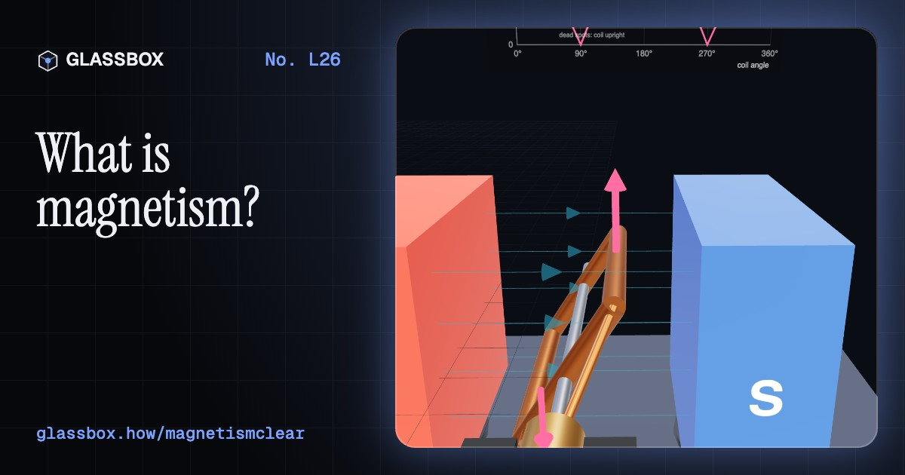
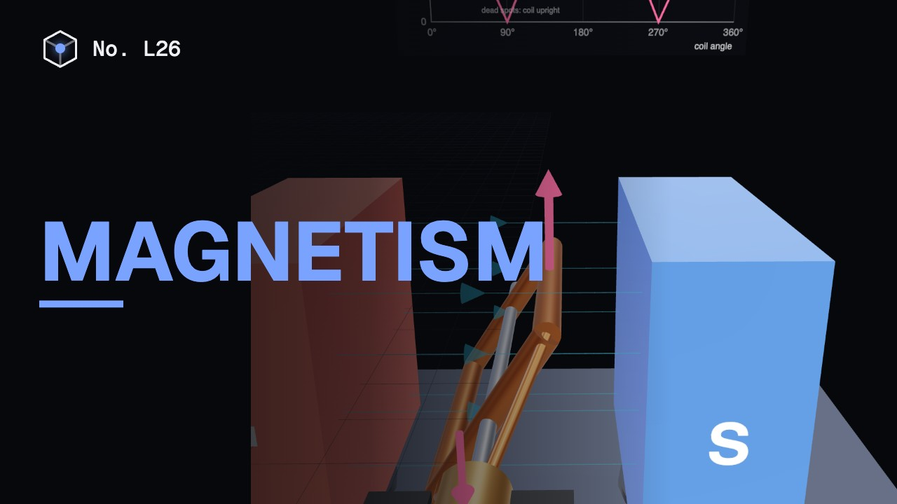
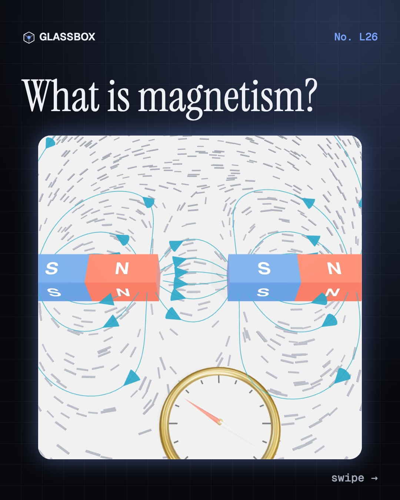
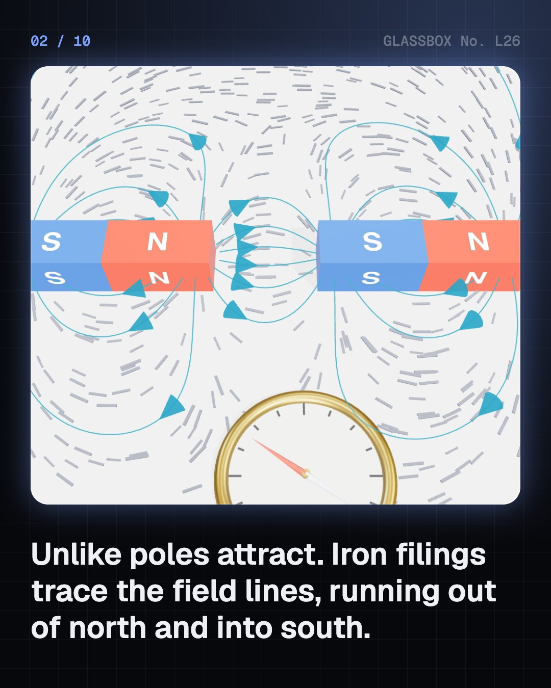
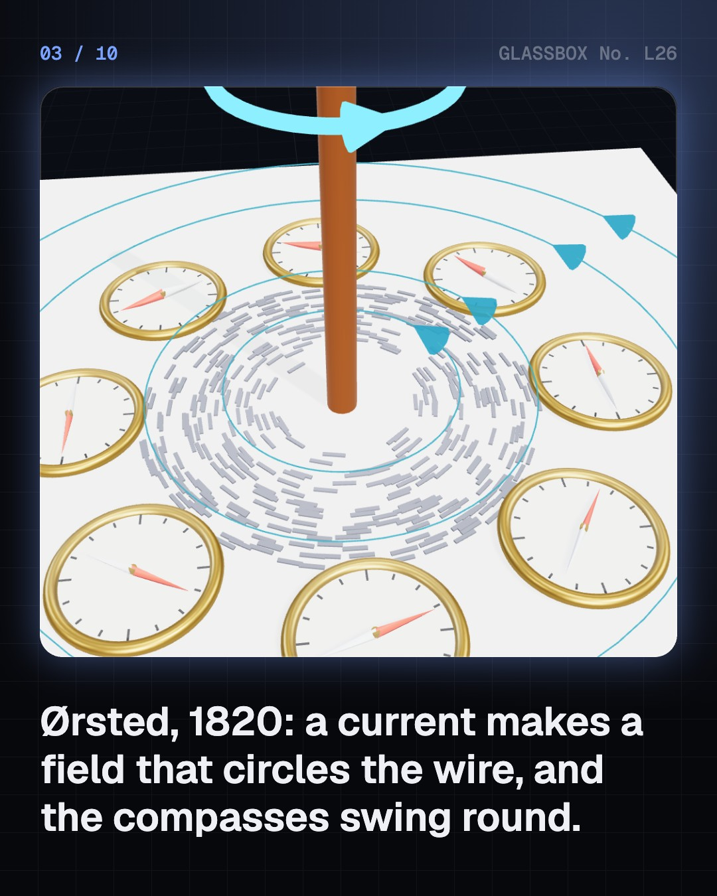
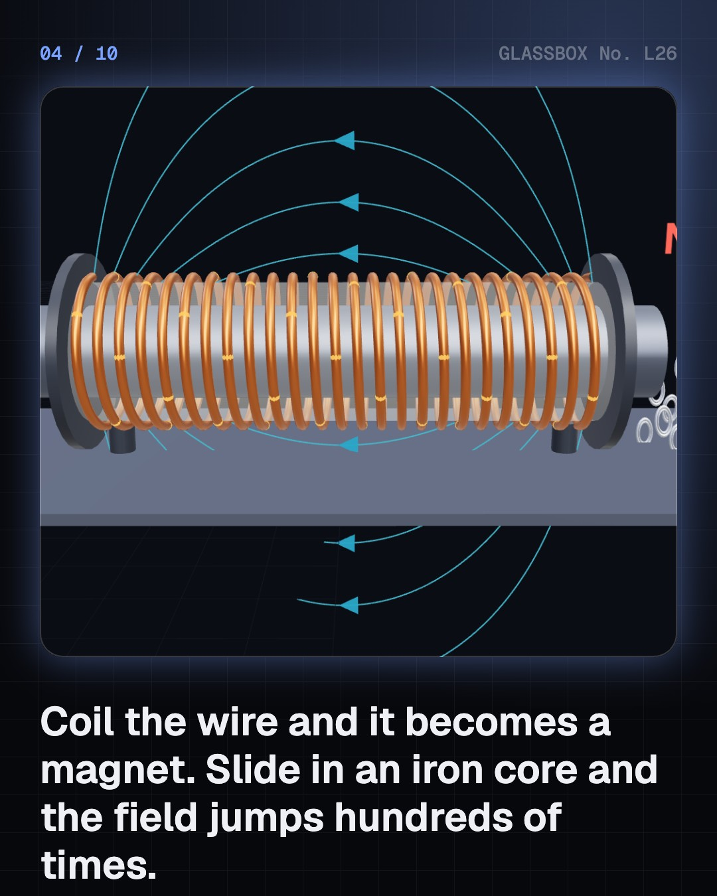

<!-- glassbox:start -->
<!-- Generated from glassbox.json by the Glassbox hub (npm run readme -- magnetismclear). Edit glassbox.json, not this block. -->
<p align="center"><a href="https://glassbox.how/e/magnetismclear/"></a></p>

<h1 align="center">Magnetism</h1>

<p align="center"><b>What is magnetism?</b><br>Iron filings trace invisible curves, a wire with current in it swings a compass, and a coil with an iron core lifts a car. Map fields in tesla, spin a motor, curl electrons in a magnetron, flip the Earth's field and heat a nail past 770 °C.</p>

<p align="center"><a href="https://glassbox.how/magnetismclear/"><b>▶ Play with it</b></a> &nbsp;·&nbsp; <a href="https://glassbox.how/e/magnetismclear/">Read the 60-second explainer</a> &nbsp;·&nbsp; <a href="https://glassbox.how/magnetismclear/glassbox/reel.mp4">Watch the 40-second video</a></p>

<p align="center">
  <a href="https://glassbox.how/e/magnetismclear/"></a>
  <a href="https://glassbox.how/e/magnetismclear/"></a>
  <a href="LICENSE"></a>
  <a href="LICENSE-CONTENT.md"></a>
  <a href="#privacy"></a>
</p>

## In 60 seconds

1. **Poles, fields and the tesla.** Like poles repel and unlike poles attract. A magnet's field runs out of north and into south, and iron filings and compasses line up along it. Field is measured in tesla: the Earth is 25–65 µT, a fridge magnet about 5 mT, an MRI 1.5–3 T. The force between magnets falls off steeply with distance.
2. **Current makes a magnet.** Ørsted found in 1820 that a current's field circles the wire, B = μ₀ I ÷ 2πr. Coil the wire and the field inside is B = μ₀ n I; add an iron core and it grows hundreds of times, until the iron saturates. Cranes, bells, relays and door locks are switchable magnets.
3. **A current in a field feels a push.** F = B I L, at right angles to field and current (Fleming's left hand). A coil with a commutator becomes a DC motor whose back-EMF chokes the current as it speeds up. A loudspeaker shakes a coil in a 1 T gap to push air.
4. **Magnets in machines.** A superconducting MRI magnet at 1.5–3 T, a magnetron's 0.17 T that curls electrons into microwaves, guitar pickups, transformers that trade volts for turns, and hard disks that store a trillion tiny magnets per square inch.
5. **Earth, hot iron and two myths.** The Earth's field is tilted, wanders and has flipped many times; it shields us and lights the aurora. Iron is magnetic because its domains line up, until 770 °C. Break a magnet and you get two magnets, and magnet bracelets have no proven healing power.

## Words worth knowing

| Term | Meaning |
|---|---|
| **Magnetic field** | The region round a magnet or current where magnetic forces act, with a strength and a direction. |
| **Tesla (T)** | The SI unit of magnetic field (flux density). Earth ≈ 50 µT; an MRI 1.5–3 T. |
| **Magnetic poles** | The north and south ends of a magnet. Like poles repel, unlike poles attract, and they always come in pairs. |
| **Electromagnet** | A coil, usually round an iron core, that is a magnet only while current flows: B = μ₀ n I inside. |
| **Motor effect** | A current in a field feels a force F = B I L at right angles to both, shown by Fleming's left-hand rule. |
| **Magnetic domains** | Tiny regions in iron where the atoms' magnets all point one way. Lining them up magnetises the iron. |
| **Curie point** | The temperature above which a ferromagnet loses its magnetism: 770 °C for iron. |
| **Magnetosphere** | The bubble of the Earth's field in space that turns aside the solar wind and guides the aurora. |

## A short history

**From stones that pull iron to compass needles, electromagnets, MRI scanners and neodymium magnets.**

- **600 BCE** · Stones that pull iron (Thales of Miletus (attributed), Miletus, Ionia)
- **1088** · A magnetised needle, and a surprise (Shen Kuo, Song dynasty)
- **1600** · The Earth is a great magnet (William Gilbert, London)
- **1820** · Electricity makes magnetism (Hans Christian Ørsted, Copenhagen)
- **1821** · The first electric motor (Michael Faraday, Royal Institution, London)
- **1825** · The electromagnet (William Sturgeon, London)
- **1841** · India's magnetic observatory at Colaba (Colaba Observatory, later directed by Nanabhoy Moos, Colaba, Bombay (Mumbai))
- **1865** · Light is an electromagnetic wave (James Clerk Maxwell, King’s College London)

The full story, with 24 moments, charts, people and 38 sources: [glassbox.how/e/magnetismclear/history](https://glassbox.how/e/magnetismclear/history/). The data lives in [`history.json`](history.json).

## Video and slides

Made with the Glassbox studio from this box's storyboard (`window.glassbox.director`). Free to reuse under CC BY 4.0.

<a href="https://glassbox.how/magnetismclear/glassbox/video.mp4"></a>

<p><a href="glassbox/slide-1.jpg"></a> <a href="glassbox/slide-2.jpg"></a> <a href="glassbox/slide-3.jpg"></a> <a href="glassbox/slide-4.jpg"></a></p>

| File | What | Size |
|---|---|---|
| [`glassbox/reel.mp4`](https://glassbox.how/magnetismclear/glassbox/reel.mp4) | Reel / Short, with captions and soundtrack | 1080×1920 |
| [`glassbox/video.mp4`](https://glassbox.how/magnetismclear/glassbox/video.mp4) | YouTube video, with captions and soundtrack | 1920×1080 |
| `glassbox/slide-1…10.jpg` | Instagram carousel | 1080×1350 |
| `glassbox/thumb.jpg` | YouTube thumbnail | 1280×720 |
| `glassbox/cover.jpg` | Share card and repo social preview | 1200×630 |
| [`glassbox/history-reel.mp4`](https://glassbox.how/magnetismclear/glassbox/history-reel.mp4) | “History in 10 moments” Reel / Short | 1080×1920 |
| `glassbox/history-slide-*.jpg` | History carousel | 1080×1350 |
| `glassbox/post.json` | Post copy and schedule used by the publish kit | |

## Privacy

This box has no accounts and no ads, and it ships its own fonts and libraries. When you run it yourself it sends nothing anywhere. On glassbox.how, the site's `/bar.js` also loads Glassbox's analytics: **Google Analytics** to count visits (it asks first in the EU, UK and Switzerland, and stays off when your browser sends Global Privacy Control or Do Not Track) and **ClickTrust** to detect bots.

It remembers a few things **in your own browser only**, and never sends them anywhere:

| Browser storage key | What it holds |
|---|---|
| `magnetismclear.v1` | Which chapters you have opened, your best quiz scores, and sound on or off. |

Exactly what each one sees is at [glassbox.how/privacy](https://glassbox.how/privacy/).

## Licences

- **Code:** [MIT](LICENSE). Use it, change it, ship it.
- **Explanations, text, images and videos** (`glassbox.json`, `glassbox/`): [CC BY 4.0](LICENSE-CONTENT.md). Credit “Glassbox, glassbox.how/e/magnetismclear”.
- **Third-party parts** keep their own licences: [three.js](https://threejs.org) (MIT), [Geist, Instrument Serif](https://openfontlicense.org) (SIL OFL 1.1).
- The Glassbox name and logo aren't covered by either licence. See the [terms](https://glassbox.how/terms/).

Found a mistake? [Open an issue](https://github.com/bdeeps/magnetismclear/issues). Corrections happen in public.
<!-- glassbox:end -->

## Run it

It's plain HTML, CSS and JavaScript. No build step and no dependencies. Run locally, it contacts no other website.

```bash
python3 -m http.server 8000
```

Three.js and the fonts ship in `vendor/` and `fonts/`, so it also works offline.

Then open http://localhost:8000.

## How it's built

| File | What |
|---|---|
| `index.html`, `css/app.css` | The page and its styles |
| `js/app.js`, `js/stage.js`, `js/ui.js`, `js/kit.js` | The shared Glassbox 3D engine: chapters, 3D stage, controls, quiz, video director |
| `js/chapters/*.js` | One file per chapter: the 3D model, controls, text, key terms, quiz and video scenes |
| `js/magnetism.js` | Shared parts and physics: μ₀, magnet materials, the pole model of a magnet's field and force, a field-line tracer, fat field lines with arrow heads, bar magnets, compasses, iron filings, chart boards, arrows, dragging on the table, number formatting |
| `glassbox.json` | Title, question, explainer beats, key terms, browser storage and credits shown on glassbox.how |
| `reel` in each chapter | The storyboard the Glassbox studio records into short videos |
| `glassbox/` | The published video, slides, thumbnail and post copy |
| `fonts/`, `vendor/three/` | Self-hosted Geist and Instrument Serif (SIL OFL 1.1) and three.js (MIT) |
